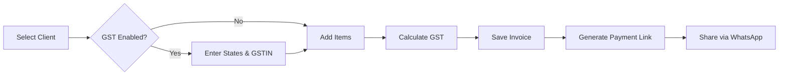

# Quick Integration Guide

## ✅ Components Ready for Integration

### 1. **GST Form Component**

**File:**
[`components/invoice/InvoiceFormGST.tsx`](file:///e:/Invoice%20Ease/components/invoice/InvoiceFormGST.tsx)

**Usage in Invoice Creation:**

```tsx
import InvoiceFormGST from "@/components/invoice/InvoiceFormGST";

// In your state
const [isGstEnabled, setIsGstEnabled] = useState(true);
const [businessState, setBusinessState] = useState("");
const [businessGstin, setBusinessGstin] = useState("");
const [clientState, setClientState] = useState("");
const [clientGstin, setClientGstin] = useState("");

// In your JSX
<InvoiceFormGST
    isGstEnabled={isGstEnabled}
    onGstToggle={setIsGstEnabled}
    businessState={businessState}
    onBusinessStateChange={setBusinessState}
    businessGstin={businessGstin}
    onBusinessGstinChange={setBusinessGstin}
    clientState={clientState}
    onClientStateChange={setClientState}
    clientGstin={clientGstin}
    onClientGstinChange={setClientGstin}
/>;
```

### 2. **Payment Link Button**

**File:**
[`components/invoice/PaymentLinkButton.tsx`](file:///e:/Invoice%20Ease/components/invoice/PaymentLinkButton.tsx)

**Usage on Invoice View:**

```tsx
import PaymentLinkButton from "@/components/invoice/PaymentLinkButton";

<PaymentLinkButton
    invoice={invoice}
    client={client}
    onLinkCreated={(url) => {
        // Update invoice with payment link
        console.log("Payment link created:", url);
    }}
/>;
```

### 3. **WhatsApp Share Button**

**Already integrated in:**
[`app/invoice/[id]/page.tsx`](file:///e:/Invoice%20Ease/app/invoice/[id]/page.tsx)

### 4. **GST Calculator**

**File:**
[`components/invoice/GSTCalculator.tsx`](file:///e:/Invoice%20Ease/components/invoice/GSTCalculator.tsx)

**Usage in Invoice Summary:**

```tsx
import GSTCalculator from "@/components/invoice/GSTCalculator";

<GSTCalculator
    subtotal={subtotal}
    taxRate={18}
    businessState="Maharashtra"
    clientState="Karnataka"
    onChange={(calculation) => {
        // Update invoice totals
        setCgst(calculation.cgst);
        setSgst(calculation.sgst);
        setIgst(calculation.igst);
        setGrandTotal(calculation.grandTotal);
    }}
/>;
```

### 5. **State Selection Dropdown**

**File:**
[`components/ui/Select.tsx`](file:///e:/Invoice%20Ease/components/ui/Select.tsx)

**Usage:**

```tsx
import { StateSelect } from "@/components/ui/Select";

<StateSelect
    label="Select State"
    value={state}
    onChange={(e) => setState(e.target.value)}
    required
/>;
```

---

## 🎯 Where to Add These Components

### Invoice Creation Form (`app/dashboard/invoices/new/page.tsx`)

**Add after client selection:**

1. GST Form Component (InvoiceFormGST) - after invoice details card
2. Calculate GST in `handleSubmit` using `calculateInvoiceGST()` from
   `lib/gst.ts`
3. Save GST amounts to invoice table

**Invoice items table:**

- Add HSN code column (optional)
- Show tax rate per item

### Invoice View Page (`app/dashboard/invoices/[id]/page.tsx`)

**Add after invoice details:**

1. GST Calculator component to show breakdown
2. Payment Link Button component
3. WhatsApp Share Button (already done ✅)

### Client Form (`app/dashboard/clients`)

**Add fields:**

1. State dropdown (StateSelect)
2. GSTIN input (optional, for B2B)

---

## 🔄 Complete Invoice Creation Flow



---

## 📝 Database Fields to Save

When creating invoice with GST:

```typescript
{
  // Existing fields
  ...existingInvoiceData,
  
  // New GST fields
  is_gst_invoice: isGstEnabled,
  place_of_supply: clientState,  cgst_amount: gstCalculation.cgst,
  sgst_amount: gstCalculation.sgst,
  igst_amount: gstCalculation.igst,
  tax_total: gstCalculation.totalTax,
  grand_total: gstCalculation.grandTotal,
  
  // Payment fields (set later)
  payment_link_id: null,
  payment_link_url: null,
}
```

---

## ⚡ Quick Wins

**Minimum viable GST integration (30 min):**

1. Add InvoiceFormGST component to invoice creation
2. Save GST amounts when creating invoice
3. Show GST Calculator on invoice view page

**Full WhatsApp-first flow (1 hour):**

1. Above + Payment Link Button on invoice view
2. Share via WhatsApp with payment link
3. Test end-to-end flow

---

## 🧪 Testing Checklist

- [ ] Create invoice with GST enabled
- [ ] Verify CGST+SGST for same state
- [ ] Verify IGST for different states
- [ ] Generate payment link
- [ ] Share via WhatsApp with payment link
- [ ] Check database has all GST fields saved

---

**All components are ready! Just need to integrate into existing pages.**
